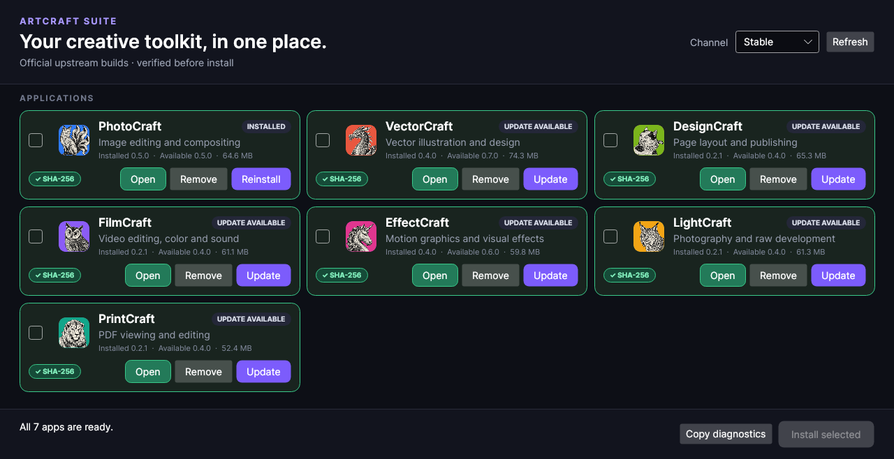

# ArtCraft Suite Manager

A lightweight, independent installer and update manager for the seven
[ArtCraft crafting apps](https://github.com/storytold). The first supported target
is Windows x64; a macOS Apple Silicon build scaffold is included.

> **Independent open-source project:** this repository is not maintained, sponsored, or endorsed
> by storytold or the ArtCraft team. It downloads unmodified packages from their
> official GitHub releases.



## What works

- Finds PhotoCraft, VectorCraft, DesignCraft, FilmCraft, EffectCraft, LightCraft,
  and PrintCraft from a readable JSON manifest.
- Shows official upstream application icons with their source and license
  provenance preserved under [`assets/icons`](assets/icons/README.md).
- Offers **Stable** (newest non-prerelease) and **Latest** (newest release,
  including prereleases) channels.
- Installs official Windows x64 ZIP builds for the current user, with no
  administrator prompt, under `%LOCALAPPDATA%\ArtCraftSuite\apps`.
- Requires SHA-256 verification before extraction. It prefers GitHub's immutable
  release-asset digest and falls back to the upstream `SHA256SUMS.txt` file.
- Stages updates before swapping directories, defends against ZIP path traversal,
  launches installed apps, and removes only manager-owned app directories.
- Journals every update, rolls back failures automatically, and retains the prior
  working version so an interrupted process can recover safely on next launch.
- Resumes partial downloads, caches release metadata with GitHub ETags for offline
  startup, and offers a copyable diagnostic report backed by structured JSON logs.
- Builds a self-contained Windows x64 release artifact in GitHub Actions.
- Handles PrintCraft releases whose package and executable are named `pdfcraft`.

## Download and run

Download `ArtCraftSuite-windows-x64.zip` from this repository's Releases page,
extract it, and run `ArtCraftSuite.exe`. Windows may show a SmartScreen warning
for unsigned community builds; review the release checksum and source before
continuing.

The manager itself does not need administrator rights. Each creative application
keeps its own settings and documents outside the manager-owned installation
folder, so updating or removing an app does not intentionally remove user work.

If anonymous GitHub rate limits are a problem, advanced users may set
`ARTCRAFT_GITHUB_TOKEN` before launching the manager. The token is sent only to
GitHub and is never written to logs or the diagnostic report.

## Build locally

Install the [.NET 8 SDK](https://dotnet.microsoft.com/download/dotnet/8.0), then:

```powershell
dotnet restore
dotnet build -c Release
dotnet run --project tests/ArtCraftSuite.Tests -c Release
dotnet run --project src/ArtCraftSuite
```

Publish the same self-contained Windows build produced by CI:

```powershell
dotnet publish src/ArtCraftSuite/ArtCraftSuite.csproj -c Release -r win-x64 \
  --self-contained true -p:PublishSingleFile=true -p:IncludeNativeLibrariesForSelfExtract=true
```

## Manifest

[`manifest/apps.json`](manifest/apps.json) is intentionally data-driven. Each app
declares its upstream `owner/repository` and anchored asset-name patterns. Tokens
`{id}` and `{version}` are escaped before matching. A manifest change cannot bypass
the runtime hash requirement.

## C# production and Rust status

The production Windows line is C# / Avalonia on the `csharp-v0.3` branch. The
native Rust v0.2 implementation, including its macOS ARM64 installer, remains
active on `rust-0.2`. It is intentionally allowed to trail the production C#
feature set while v0.3 is stabilized; fixes can be ported after they are proven
on Windows. Do not delete or rewrite the Rust branch when promoting C# releases.

The C# project still compiles an unsigned macOS ARM64 scaffold, but automatic DMG
installation belongs to the Rust line until it is deliberately ported.

See [`docs/MACOS.md`](docs/MACOS.md) for the completion plan.

## Security and privacy

The app talks only to `api.github.com` and the GitHub release download URLs selected
from the manifest. It has no telemetry and does not require a GitHub token. GitHub's
unauthenticated API rate limit applies. See [`SECURITY.md`](SECURITY.md) for the
verification and reporting model.

Downloaded packages remain untrusted until their expected length and SHA-256 are
verified. ZIP extraction rejects traversal, symbolic links, excessive entry counts,
and more than 16 GiB of declared expanded data.

## Contributing

Issues and pull requests are welcome. Please read [`CONTRIBUTING.md`](CONTRIBUTING.md).
By submitting a contribution, you agree to the contribution terms in the project
license.

## License

ArtCraft Suite Manager is licensed under the Apache License, Version 2.0.
See [`LICENSE`](LICENSE) for the terms and [`NOTICE`](NOTICE) for attribution.
The upstream ArtCraft applications and other dependencies keep their own licenses
and attributions, listed in [`THIRD_PARTY_NOTICES.md`](THIRD_PARTY_NOTICES.md).

Repository owners can follow the exact steps in [`PUBLISHING.md`](PUBLISHING.md)
to push the source and create the first automated release.

The reliability guarantees and deliberate feature boundaries for this release are
documented in [`docs/TRUST_CORE.md`](docs/TRUST_CORE.md).
